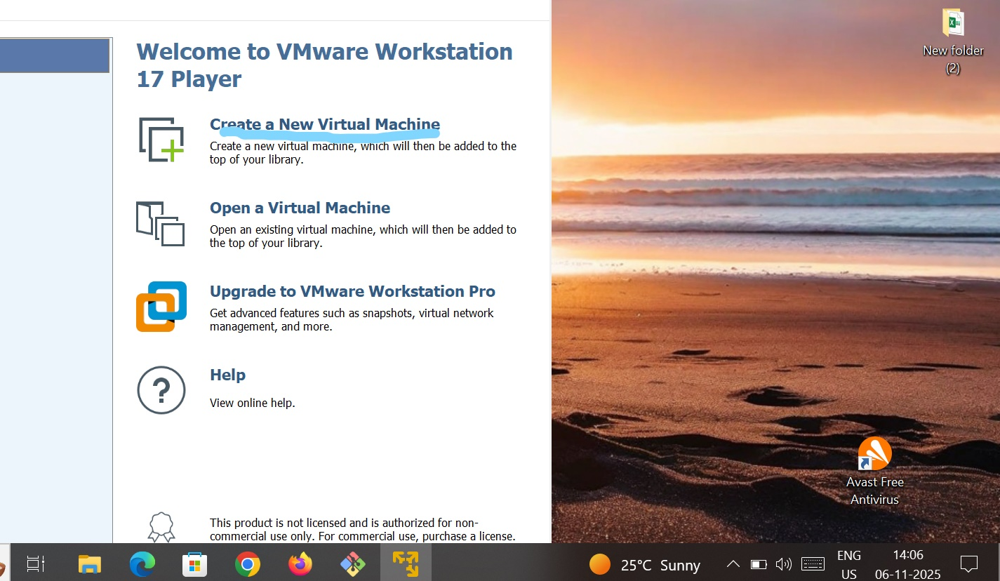
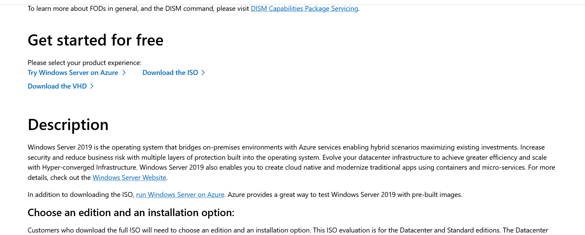
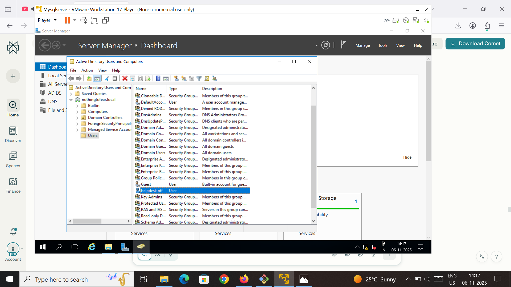
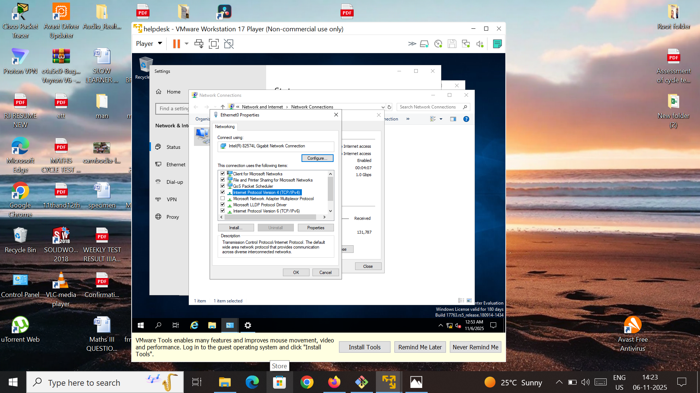
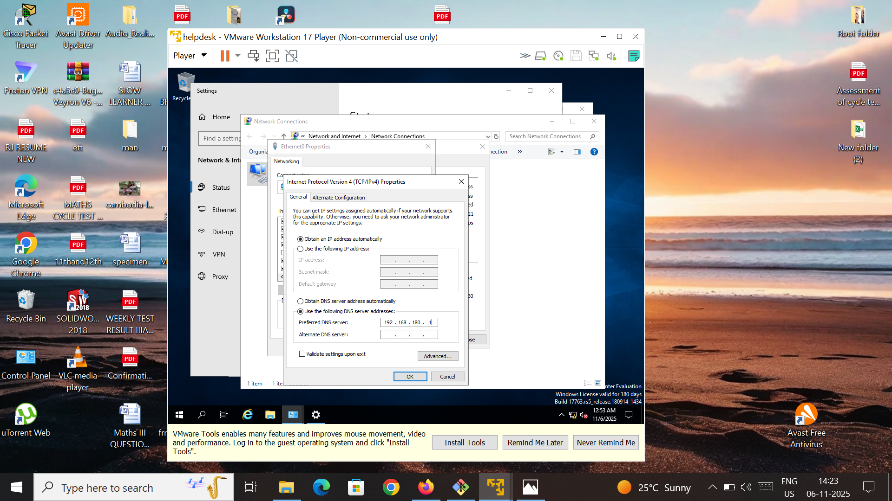
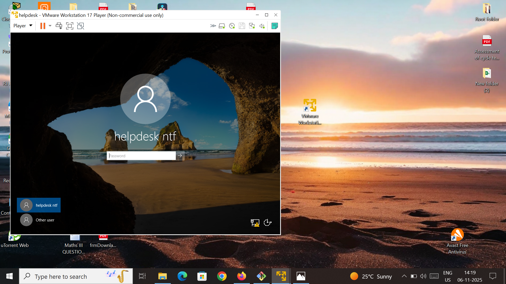
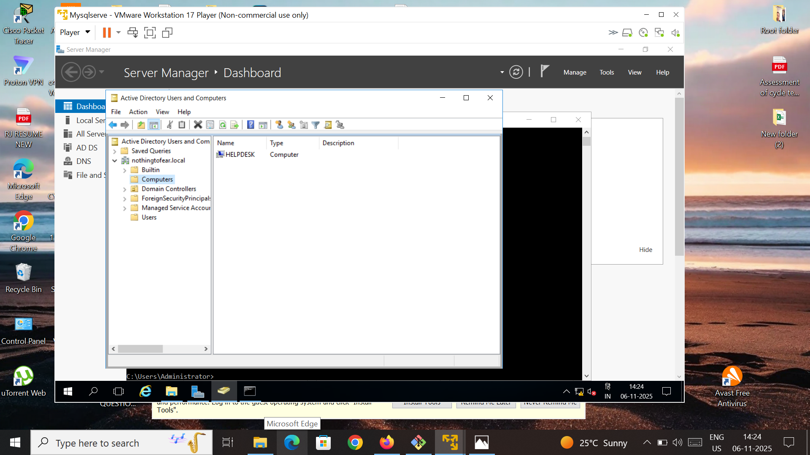

# Step-by-Step Lab Guide: Active Directory Setup in VMware

## Environment Preparation

1. **Install VMware Workstation Player**  
   

2. **Download Windows Server 2019 Evaluation ISO**  
   

---

## VM Creation

1. **Create VM #1 for Windows Server 2019**  
2. **Create VM #2 for the client system**  
3. Use "Installer disc image file (iso)" for the installation  
   

---

## Server Configuration

1. **Install AD DS (Active Directory Domain Services) role**  
   

2. **Configure Server Manager and AD DS**  
     
3. **Promote the server to a Domain Controller**
   Example: `nothingtofear.local` to check use command whoami /fqdn
---

## User Creation

1. Open **Active Directory Users and Computers**  
2. Create a user: `helpdesk ntf`  
   

---

## Joining Client VM helpdesk to Domain

1. On the client VM, open **System Properties** and attempt to join the domain (`nothingtofear.local`)  
     
   

**Problem:** Direct entry of domain fails due to network/DNS issues.

**Troubleshooting Steps:**

1. Check the network adapter properties  
   

2. Set the DNS server manually to the Domain Controller’s IP  
   
   

3. Retry domain join  
     
   
   Now the user `helpdesk ntf` can log in successfully  

---

## Final Verification

1. Log in to client VM as the AD user `helpdesk ntf`  
   

2. Computer shows as domain-joined in AD  
   

---

## Problem Faced and Solution

**Issue:** Directly entering the domain name during client join fails with "AD DC could not be contacted".  

**Solution:**  
Manually set the preferred DNS server on the client VM’s Ethernet adapter to the Domain Controller’s static IP. This allows the client to resolve and contact the domain controller.

---

## Key Learning Outcomes

- AD setup and domain controller installation in a VM  
- Network configuration and DNS troubleshooting for domain joining  
- Manual user creation and successful domain logon from the client  
- Understanding network dependencies for AD environments

---

## Credits

Project by **Rajnish Kumar**. Lab practiced and documented for learning **Active Directory, Windows Server, VMware Workstation**, and troubleshooting domain setups.

